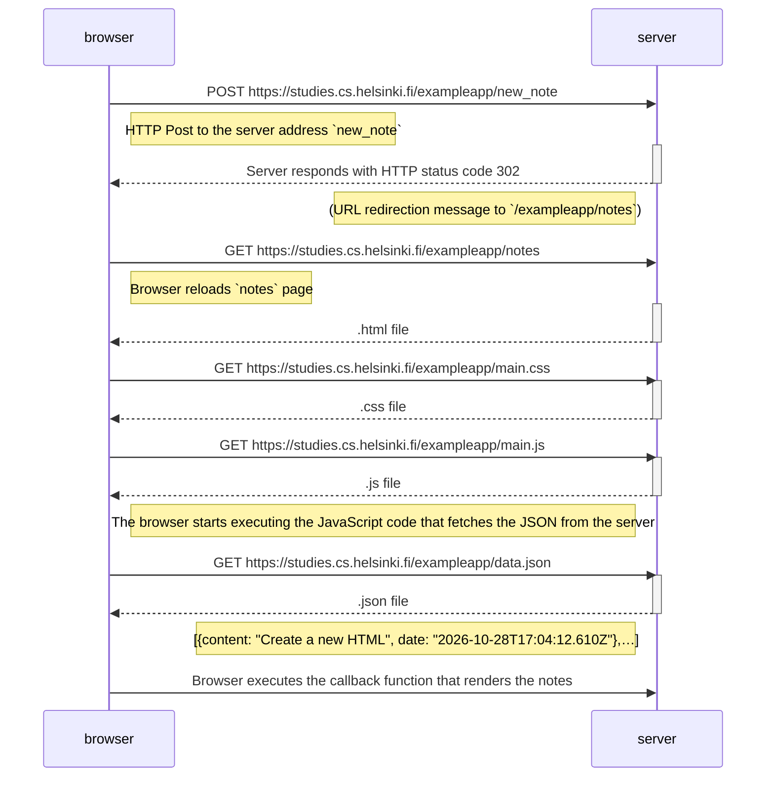

```mermaid
sequenceDiagram
participant browser
participant server

    browser->>server: POST https://studies.cs.helsinki.fi/exampleapp/new_note

    Note right of browser: HTTP Post to the server address `new_note`

    activate server
    server-->>browser: Server responds with HTTP status code 302
    deactivate server

    Note left of server: (URL redirection message to `/exampleapp/notes`)

    browser->>server: GET https://studies.cs.helsinki.fi/exampleapp/notes

    Note right of browser: Browser reloads `notes` page

    activate server
    server-->>browser: .html file
    deactivate server


    browser->>server: GET https://studies.cs.helsinki.fi/exampleapp/main.css
    activate server
    server-->>browser: .css file
    deactivate server

    browser->>server: GET https://studies.cs.helsinki.fi/exampleapp/main.js
    activate server
    server-->>browser: .js file
    deactivate server

    Note right of browser: The browser starts executing the JavaScript code that fetches the JSON from the server

    browser->>server: GET https://studies.cs.helsinki.fi/exampleapp/data.json
    activate server
    server-->>browser: .json file
    deactivate server

    Note left of server: [{content: "Create a new HTML", date: "2026-10-28T17:04:12.610Z"},…]

    browser->>server: Browser executes the callback function that renders the notes
```
